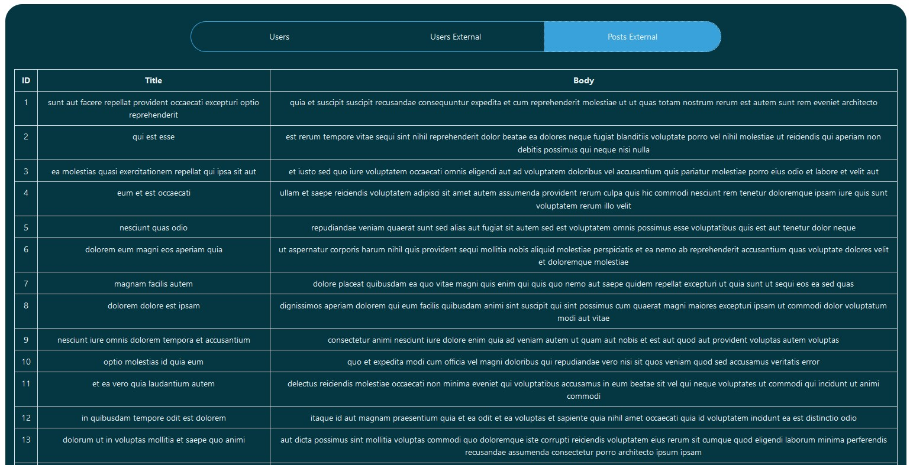

# React Table
React web application to parse JSON Data into React tabs and table components

To run the application

1. Clone this repo
2. Run `npm install`
3. Run `npm start`# robofriends

## Built With

* HTML
* CSS
* Javascript
* React
* Bootstrap

## Data Source

This application shows users JSON data from local `users.js` on the first tab, users data from external JSON source on the second tab and posts data from external JSON source on the third tab.

The external json data website used in this application is [JSON Placeholder](https://jsonplaceholder.typicode.com/)

## Screenshots

